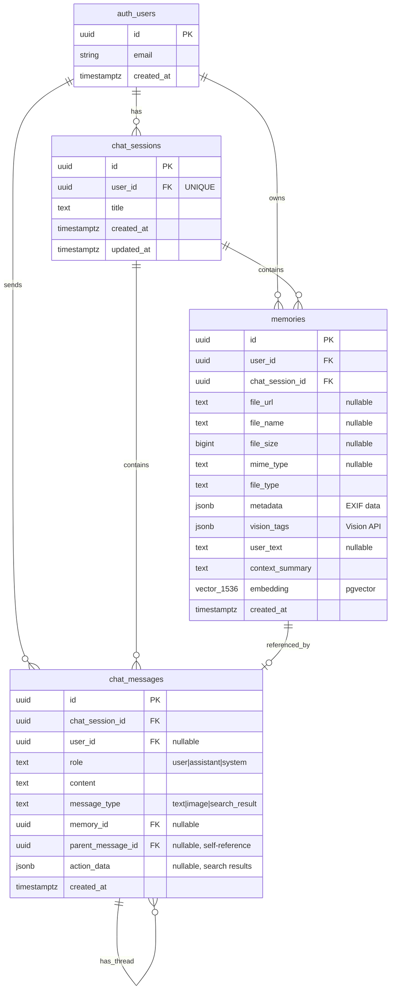

# Database Schema Design - Project Synapse

> **PostgreSQL + pgvector 기반 RAG 지식 베이스 설계**

---

## 목차

1. [개요](#-개요)
2. [ERD (Entity Relationship Diagram)](#-erd-entity-relationship-diagram)
3. [테이블 상세 설명](#-테이블-상세-설명)
4. [인덱스 전략](#-인덱스-전략)
5. [RPC 함수](#-rpc-함수)
6. [데이터 흐름](#-데이터-흐름)
7. [설계 원칙 및 결정 사항](#-설계-원칙-및-결정-사항)
8. [성능 최적화](#-성능-최적화)
9. [확장성 고려사항](#-확장성-고려사항)

---

## 개요

### 데이터베이스 기술 스택

```yaml
Database: PostgreSQL 15+
Extension: pgvector (벡터 유사도 검색)
Platform: Supabase (PostgreSQL + Auth + Storage)
Vector Dimension: 1536 (text-embedding-3-small)
Index Type: HNSW (Hierarchical Navigable Small World)
```

### 설계 목표

- **멀티모달 데이터 통합**: 사진, 메모, 대화를 하나의 스키마로 통합
- **벡터 검색 성능**: pgvector + HNSW 인덱스로 50ms 이내 검색
- **스레드 대화 지원**: 부모-자식 메시지 구조로 무한 깊이 대화
- **상태 영속성**: 검색 결과를 JSONB로 저장하여 새로고침 후에도 복원
- **확장성**: 향후 PDF, 음성, 동영상 등 멀티모달 확장 가능

---

## ERD (Entity Relationship Diagram)

### 전체 ERD (Mermaid)



### 관계 요약

| 관계 | 설명 | Cardinality |
|-----|------|-------------|
| `auth.users` → `chat_sessions` | 사용자당 메인 피드 1개 | 1:1 (UNIQUE) |
| `auth.users` → `memories` | 사용자가 여러 기억 소유 | 1:N |
| `auth.users` → `chat_messages` | 사용자가 여러 메시지 전송 | 1:N |
| `chat_sessions` → `memories` | 세션에 여러 기억 저장 | 1:N |
| `chat_sessions` → `chat_messages` | 세션에 여러 메시지 저장 | 1:N |
| `memories` → `chat_messages` | 기억이 메시지에서 참조됨 | 1:N (optional) |
| `chat_messages` → `chat_messages` | 메시지 간 스레드 관계 | 1:N (self-reference) |

---

## 테이블 상세 설명

### 1. `chat_sessions` (채팅 세션)

**목적**: 사용자당 메인 피드 세션 1개를 관리

**설계 결정**:
- 사용자당 1개만 존재 (`user_id UNIQUE`)
- 최초 로그인 시 자동 생성, 이후 영구 재사용
- 카카오톡 1:1 채팅방처럼 모든 인풋이 이 세션에 누적

```sql
CREATE TABLE IF NOT EXISTS public.chat_sessions (
  id            UUID PRIMARY KEY DEFAULT gen_random_uuid(),
  user_id       UUID NOT NULL UNIQUE REFERENCES auth.users(id) ON DELETE CASCADE,
  title         TEXT DEFAULT '내 피드',
  created_at    TIMESTAMPTZ NOT NULL DEFAULT now(),
  updated_at    TIMESTAMPTZ NOT NULL DEFAULT now()
);
```

#### 컬럼 설명

| 컬럼명 | 타입 | NULL | 기본값 | 설명 |
|-------|------|------|--------|------|
| `id` | UUID | ❌ | `gen_random_uuid()` | 세션 고유 ID (PK) |
| `user_id` | UUID | ❌ | - | Supabase Auth 사용자 ID (FK, **UNIQUE**) |
| `title` | TEXT | ✅ | `'내 피드'` | 세션 제목 (기본값) |
| `created_at` | TIMESTAMPTZ | ❌ | `now()` | 세션 생성 시각 |
| `updated_at` | TIMESTAMPTZ | ❌ | `now()` | 세션 업데이트 시각 |

#### 제약 조건

```sql
UNIQUE (user_id)              -- 사용자당 1개만 존재
FOREIGN KEY (user_id) REFERENCES auth.users(id) ON DELETE CASCADE
```

#### 인덱스

- `user_id` UNIQUE 제약이 자동으로 인덱스 생성

#### 예시 데이터

| id                                   | user_id                              | title     | created_at |
|--------------------------------------|--------------------------------------|-----------|-------------------------|
| 550e8400-e29b-41d4-a716-446655440000 | 123e4567-e89b-12d3-a456-426614174000 | 내 피드   | 2026-02-15 10:00:00+00 |

---

### 2. `memories` (기억 저장소)

**목적**: 사진, 사진+텍스트, 텍스트 메모를 통합 저장하고 벡터화

**설계 결정**:
- 임베딩(벡터화)은 이 테이블에서만 수행
- `chat_messages`는 순수 채팅 표시 전용 (벡터화 없음)
- 3가지 저장 유형 지원:
  - **사진만**: `file_url` ✅, `vision_tags` ✅, `user_text` ❌
  - **사진+텍스트**: `file_url` ✅, `vision_tags` ✅, `user_text` ✅
  - **텍스트 메모**: `file_url` ❌, `vision_tags` ❌, `user_text` ✅

```sql
CREATE TABLE IF NOT EXISTS public.memories (
  id                UUID PRIMARY KEY DEFAULT gen_random_uuid(),
  user_id           UUID NOT NULL REFERENCES auth.users(id) ON DELETE CASCADE,
  chat_session_id   UUID REFERENCES public.chat_sessions(id) ON DELETE CASCADE,

  -- 사진 관련 (텍스트 메모일 경우 모두 NULL)
  file_url          TEXT,
  file_name         TEXT,
  file_size         BIGINT,
  mime_type         TEXT,
  file_type         TEXT DEFAULT 'image',

  -- 메타데이터 (프론트엔드 exifr 추출)
  metadata          JSONB,

  -- Vision API 시각적 태그
  vision_tags       JSONB,

  -- 사용자가 함께 입력한 텍스트
  user_text         TEXT,

  -- metadata + vision_tags + user_text를 종합하여 AI가 생성한 자연어 요약글
  context_summary   TEXT,

  -- context_summary를 OpenAI text-embedding-3-small로 변환한 벡터
  embedding         vector(1536),

  created_at        TIMESTAMPTZ NOT NULL DEFAULT now()
);
```

#### 컬럼 설명

| 컬럼명 | 타입 | NULL | 설명 |
|-------|------|------|------|
| `id` | UUID | ❌ | 기억 고유 ID (PK) |
| `user_id` | UUID | ❌ | 소유자 (FK) |
| `chat_session_id` | UUID | ✅ | 연결된 세션 (FK) |
| `file_url` | TEXT | ✅ | Supabase Storage URL (메모일 때 NULL) |
| `file_name` | TEXT | ✅ | 원본 파일명 |
| `file_size` | BIGINT | ✅ | 파일 크기 (bytes) |
| `mime_type` | TEXT | ✅ | MIME 타입 (예: `image/jpeg`) |
| `file_type` | TEXT | ✅ | 파일 종류 (기본값: `'image'`) |
| `metadata` | JSONB | ✅ | EXIF 메타데이터 (GPS, 촬영시간 등) |
| `vision_tags` | JSONB | ✅ | Vision API 결과 (objects, colors, mood) |
| `user_text` | TEXT | ✅ | 사용자 입력 텍스트 |
| `context_summary` | TEXT | ✅ | AI 생성 자연어 요약 |
| `embedding` | vector(1536) | ✅ | 1536차원 임베딩 벡터 |
| `created_at` | TIMESTAMPTZ | ❌ | 생성 시각 |

#### JSONB 스키마 예시

**`metadata` (프론트엔드 exifr 추출)**:
```json
{
  "derived": {
    "latitude": 35.1796,
    "longitude": 129.0756
  },
  "location": {
    "hasLocation": true,
    "shortAddress": "부산 해운대구",
    "poi": "해운대 해수욕장"
  },
  "captureTime": {
    "year": 2023,
    "month": 12,
    "day": 25,
    "hour": 14,
    "minute": 30
  },
  "environment": {
    "weather": "맑음",
    "temperature": "10°C"
  }
}
```

**`vision_tags` (Vision API 결과)**:
```json
{
  "objects": ["바다", "모래사장", "파도", "하늘"],
  "peopleCount": 2,
  "dominantColors": ["Blue", "White", "Yellow"],
  "scene": "해변 풍경",
  "mood": "평화로움"
}
```

#### 인덱스

```sql
-- 사용자별 기억 조회용
CREATE INDEX idx_memories_user_id ON public.memories(user_id);

-- 세션별 기억 조회용
CREATE INDEX idx_memories_session_id ON public.memories(chat_session_id);

-- 벡터 유사도 검색 성능을 위한 HNSW 인덱스 ⭐
CREATE INDEX idx_memories_embedding
ON public.memories USING hnsw (embedding vector_cosine_ops);
```

#### 예시 데이터

| id        | user_id  | file_url                  | user_text      | context_summary                      | embedding |
|-----------|----------|---------------------------|----------------|--------------------------------------|-----------|
| uuid-001  | user-123 | https://.../photo.jpg     | 바다 너무 좋아 | 2023년 12월 부산 해운대 바다...      | [0.12, -0.34, ...] |
| uuid-002  | user-123 | NULL                      | 오늘 힘들었어  | 2026년 3월 19일 힘든 하루를 보냄... | [0.45, 0.21, ...] |

---

### 3. `chat_messages` (채팅 메시지)

**목적**: 메인 피드와 스레드 내 모든 메시지를 통합 저장 (화면 표시 전용)

**설계 결정**:
- 벡터화(임베딩) 없음 (순수 채팅 말풍선 표시 용도)
- `parent_message_id`로 메인 피드 vs 스레드 구분:
  - `parent_message_id IS NULL` → 메인 피드 메시지
  - `parent_message_id IS NOT NULL` → 스레드 메시지
- `action_data` JSONB로 검색 결과 저장 (상태 영속성)

```sql
CREATE TABLE IF NOT EXISTS public.chat_messages (
  id                  UUID PRIMARY KEY DEFAULT gen_random_uuid(),
  chat_session_id     UUID NOT NULL REFERENCES public.chat_sessions(id) ON DELETE CASCADE,
  user_id             UUID REFERENCES auth.users(id) ON DELETE SET NULL,
  role                TEXT NOT NULL CHECK (role IN ('user', 'assistant', 'system')),
  content             TEXT,
  message_type        TEXT NOT NULL DEFAULT 'text' CHECK (message_type IN ('text', 'image', 'search_result')),
  memory_id           UUID REFERENCES public.memories(id) ON DELETE SET NULL,
  parent_message_id   UUID REFERENCES public.chat_messages(id) ON DELETE CASCADE,
  action_data         JSONB,
  created_at          TIMESTAMPTZ NOT NULL DEFAULT now()
);
```

#### 컬럼 설명

| 컬럼명 | 타입 | NULL | 제약 | 설명 |
|-------|------|------|------|------|
| `id` | UUID | ❌ | PK | 메시지 고유 ID |
| `chat_session_id` | UUID | ❌ | FK | 속한 세션 |
| `user_id` | UUID | ✅ | FK | 발신자 (삭제 시 NULL) |
| `role` | TEXT | ❌ | CHECK | 발신자 역할 (`user`, `assistant`, `system`) |
| `content` | TEXT | ✅ | - | 메시지 본문 |
| `message_type` | TEXT | ❌ | CHECK | 메시지 유형 (`text`, `image`, `search_result`) |
| `memory_id` | UUID | ✅ | FK | 연결된 기억 (사진 카드, 메모 등) |
| `parent_message_id` | UUID | ✅ | FK, **Self-Reference** | 스레드 부모 (NULL이면 메인 피드) |
| `action_data` | JSONB | ✅ | - | 검색 결과 등 구조화된 데이터 |
| `created_at` | TIMESTAMPTZ | ❌ | - | 생성 시각 |

#### `message_type` 설명

| Type | 용도 | 예시 |
|------|------|------|
| `text` | 일반 텍스트/메모 | "오늘 날씨 좋네요" |
| `image` | 사진 업로드 카드 | 사진 1장 표시, `memory_id` 연결 |
| `search_result` | RAG 검색 결과 카드 | 사진 3개 검색 결과, `action_data` 활용 |

#### `action_data` JSONB 스키마

**검색 결과 예시**:
```json
{
  "action": "search_photos",
  "query": "작년 겨울 바다",
  "results": [
    {
      "id": "uuid-001",
      "file_url": "https://.../photo1.jpg",
      "context_summary": "2023년 12월 부산 해운대...",
      "similarity": 0.85
    },
    {
      "id": "uuid-002",
      "file_url": "https://.../photo2.jpg",
      "context_summary": "2023년 12월 강릉 경포대...",
      "similarity": 0.78
    }
  ],
  "count": 2
}
```

**메모 저장 예시**:
```json
{
  "action": "save_memo",
  "content": "오늘 정말 힘들었어",
  "memory_id": "uuid-003"
}
```

#### 부모-자식 관계 예시

```
메인 피드 (parent_message_id = NULL)
├── user: "작년 겨울 바다 갔을 때 기분 어땠지?"
└── assistant: "작년 겨울 바다 사진 3개를 찾았어요..." (검색 결과)
    └── 스레드 (parent_message_id = assistant 메시지 ID)
        ├── user: "첫 번째 사진 언제 찍었어?"
        ├── assistant: "2023년 12월 25일에 찍으셨네요."
        ├── user: "그날 날씨 어땠어?"
        └── assistant: "그날은 맑은 날씨였고..."
```

#### 인덱스

```sql
-- 메인 피드 시간순 조회 + 커서 기반 페이지네이션용
CREATE INDEX idx_chat_messages_session_id
ON public.chat_messages(chat_session_id, created_at);

-- 스레드 조회용
CREATE INDEX idx_chat_messages_parent_id
ON public.chat_messages(parent_message_id);

-- action_data 검색용 GIN 인덱스
CREATE INDEX idx_chat_messages_action_data
ON public.chat_messages USING GIN (action_data);
```

#### 예시 데이터

| id       | session_id | role      | content                      | message_type  | parent_id | action_data |
|----------|------------|-----------|------------------------------|---------------|-----------|-------------|
| msg-001  | sess-123   | user      | 작년 겨울 바다 사진 찾아줘     | text          | NULL      | NULL |
| msg-002  | sess-123   | assistant | 작년 겨울 바다 사진 3개를...  | search_result | NULL      | { "action": "search_photos", ... } |
| msg-003  | sess-123   | user      | 첫 번째 사진 언제 찍었어?      | text          | msg-002   | NULL |
| msg-004  | sess-123   | assistant | 2023년 12월 25일에...         | text          | msg-002   | NULL |

---

## 인덱스 전략

### 1. B-Tree 인덱스 (기본)

**목적**: 일반적인 WHERE, JOIN, ORDER BY 쿼리 최적화

| 테이블 | 인덱스명 | 컬럼 | 용도 |
|-------|---------|------|------|
| `memories` | `idx_memories_user_id` | `user_id` | 사용자별 기억 조회 |
| `memories` | `idx_memories_session_id` | `chat_session_id` | 세션별 기억 조회 |
| `chat_messages` | `idx_chat_messages_session_id` | `(chat_session_id, created_at)` | 메인 피드 시간순 조회 + Cursor Pagination |
| `chat_messages` | `idx_chat_messages_parent_id` | `parent_message_id` | 스레드 조회 |

**쿼리 예시**:
```sql
-- 사용자의 모든 기억 조회 (idx_memories_user_id 사용)
SELECT * FROM memories WHERE user_id = '123e4567-...' ORDER BY created_at DESC;

-- 메인 피드 최근 30개 메시지 (idx_chat_messages_session_id 사용)
SELECT * FROM chat_messages
WHERE chat_session_id = '550e8400-...'
  AND parent_message_id IS NULL
ORDER BY created_at DESC
LIMIT 30;

-- 특정 메시지의 스레드 조회 (idx_chat_messages_parent_id 사용)
SELECT * FROM chat_messages
WHERE parent_message_id = 'msg-002'
ORDER BY created_at ASC;
```

---

### 2. HNSW 인덱스 (벡터 검색)

**목적**: pgvector 코사인 유사도 검색 성능 최적화

```sql
CREATE INDEX idx_memories_embedding
ON public.memories USING hnsw (embedding vector_cosine_ops);
```

**HNSW 파라미터** (Supabase 기본값):
```sql
-- m: 그래프 연결 수 (기본값: 16, 높을수록 정확하지만 느림)
-- ef_construction: 인덱스 구축 시 탐색 깊이 (기본값: 64)
-- 커스터마이징 예시:
CREATE INDEX idx_memories_embedding
ON public.memories USING hnsw (embedding vector_cosine_ops)
WITH (m = 16, ef_construction = 64);
```

**성능**:
- 인덱스 없을 때: ~500ms (전체 테이블 스캔)
- HNSW 인덱스: ~50ms (근사 최근접 이웃 탐색)
- 정확도: 99%+ (m=16, ef_construction=64)

**쿼리 예시**:
```sql
-- 벡터 유사도 검색 (idx_memories_embedding 사용)
SELECT id, context_summary, 1 - (embedding <=> '[0.12, -0.34, ...]') AS similarity
FROM memories
WHERE user_id = '123e4567-...'
  AND 1 - (embedding <=> '[0.12, -0.34, ...]') > 0.3
ORDER BY embedding <=> '[0.12, -0.34, ...]'
LIMIT 5;
```

---

### 3. GIN 인덱스 (JSONB)

**목적**: JSONB 컬럼의 키/값 검색 최적화

```sql
CREATE INDEX idx_chat_messages_action_data
ON public.chat_messages USING GIN (action_data);
```

**쿼리 예시**:
```sql
-- action_data에서 특정 action 검색 (GIN 인덱스 사용)
SELECT * FROM chat_messages
WHERE action_data->>'action' = 'search_photos';

-- JSONB 배열 검색
SELECT * FROM chat_messages
WHERE action_data->'results' @> '[{"id": "uuid-001"}]';
```

---

## RPC 함수

### `match_memories()` - 벡터 유사도 검색

**목적**: 사용자의 검색 쿼리 벡터와 유사한 기억을 찾아 반환

```sql
CREATE OR REPLACE FUNCTION match_memories(
  query_embedding   vector(1536),   -- 검색어를 임베딩한 벡터
  match_threshold   float,          -- 유사도 임계치 (예: 0.3)
  match_count       int,            -- 최대 반환 개수 (예: 5)
  filter_user_id    uuid            -- 현재 사용자 ID (내 추억만 검색)
)
RETURNS TABLE (
  id                uuid,
  chat_session_id   uuid,
  file_url          text,
  file_name         text,
  user_text         text,
  metadata          jsonb,
  vision_tags       jsonb,
  context_summary   text,
  created_at        timestamptz,
  similarity        float
)
LANGUAGE plpgsql
AS $$
BEGIN
  RETURN QUERY
  SELECT
    m.id,
    m.chat_session_id,
    m.file_url,
    m.file_name,
    m.user_text,
    m.metadata,
    m.vision_tags,
    m.context_summary,
    m.created_at,
    1 - (m.embedding <=> query_embedding) AS similarity
  FROM
    public.memories m
  WHERE
    m.user_id = filter_user_id
    AND m.embedding IS NOT NULL
    AND 1 - (m.embedding <=> query_embedding) > match_threshold
  ORDER BY
    m.embedding <=> query_embedding
  LIMIT match_count;
END;
$$;
```

#### 파라미터 설명

| 파라미터 | 타입 | 설명 | 예시 값 |
|---------|------|------|---------|
| `query_embedding` | vector(1536) | 검색어를 임베딩한 벡터 | `[0.12, -0.34, ...]` |
| `match_threshold` | float | 유사도 임계치 (0~1) | `0.3` (30% 이상 유사) |
| `match_count` | int | 최대 반환 개수 | `5` |
| `filter_user_id` | uuid | 사용자 ID (내 기억만 검색) | `123e4567-...` |

#### 반환 값 설명

| 컬럼 | 타입 | 설명 |
|-----|------|------|
| `similarity` | float | 코사인 유사도 (0~1, 높을수록 유사) |
| 나머지 | - | `memories` 테이블의 주요 컬럼 |

#### 호출 예시 (Backend)

```python
# backend/app/services/supabase_service.py
async def search_memories(
    query_embedding: list[float],
    user_id: str,
    threshold: float = 0.3,
    count: int = 5,
) -> list[dict]:
    client = get_client()

    result = client.rpc(
        "match_memories",
        {
            "query_embedding": query_embedding,
            "match_threshold": threshold,
            "match_count": count,
            "filter_user_id": user_id,
        },
    ).execute()

    return result.data
```

#### 성능 지표

- **평균 응답 시간**: ~50ms (HNSW 인덱스 활용)
- **정확도**: ~99% (m=16, ef_construction=64)
- **Threshold 권장값**: 0.3 ~ 0.5 (0.3: 폭넓은 검색, 0.5: 엄격한 검색)

---

## 데이터 흐름

### 1. 사진 업로드 → 벡터화 파이프라인

```
┌──────────────────────────────────────────────────────────┐
│ 1. 프론트엔드: 사진 업로드                                    │
│    - Supabase Storage에 사진 업로드                         │
│    - exifr로 메타데이터 추출                                 │
└──────────────────────────────────────────────────────────┘
                     ↓
┌──────────────────────────────────────────────────────────┐
│ 2. 프론트엔드: memories 테이블에 INSERT                       │
│    INSERT INTO memories (                                │
│      user_id, file_url, metadata, user_text              │
│    ) VALUES (...);                                       │
└──────────────────────────────────────────────────────────┘
                     ↓
┌──────────────────────────────────────────────────────────┐
│ 3. 프론트엔드: 백엔드 벡터화 요청                               │
│    POST /api/ai/vectorize                                │
│    { memoryId, imageUrl, metadata, userText }            │
└──────────────────────────────────────────────────────────┘
                     ↓
┌──────────────────────────────────────────────────────────┐
│ 4. 백엔드: Vision API 호출                                  │
│    vision_tags = extract_vision_tags(imageUrl)           │
│    { objects, peopleCount, colors, scene, mood }         │
└──────────────────────────────────────────────────────────┘
                     ↓
┌──────────────────────────────────────────────────────────┐
│ 5. 백엔드: Context Summary 생성                             │
│    context_summary = generate_context_summary(           │
│      metadata, vision_tags, user_text                    │
│    )                                                     │
│    "2023년 12월 부산 해운대 바다에서 찍은..."                   │
└──────────────────────────────────────────────────────────┘
                     ↓
┌──────────────────────────────────────────────────────────┐
│ 6. 백엔드: Embedding 생성                                   │
│    embedding = create_embedding(context_summary)         │
│    [0.12, -0.34, 0.56, ...] (1536차원)                    │
└──────────────────────────────────────────────────────────┘
                     ↓
┌──────────────────────────────────────────────────────────┐
│ 7. 백엔드: memories 테이블 UPDATE                           │
│    UPDATE memories SET                                   │
│      vision_tags = ...,                                  │
│      context_summary = ...,                              │
│      embedding = ...                                     │
│    WHERE id = memoryId;                                  │
└──────────────────────────────────────────────────────────┘
```

---

### 2. 자연어 검색 → 시맨틱 검색

```
┌──────────────────────────────────────────────────────────┐
│ 1. 사용자: 자연어 검색 입력                                   │ 
│    "작년 겨울 바다 갔을 때 기분 어땠지?"                         │
└──────────────────────────────────────────────────────────┘
                     ↓
┌──────────────────────────────────────────────────────────┐
│ 2. 프론트엔드: 백엔드에 메시지 전송                              │
│    POST /api/ai/message                                  │
│    { message, userId, sessionId }                        │
└──────────────────────────────────────────────────────────┘
                     ↓
┌──────────────────────────────────────────────────────────┐
│ 3. 백엔드: MCP Tool Calling (1st Turn)                     │
│    LLM이 의도 분석 → "search_memories" 도구 선택              │
└──────────────────────────────────────────────────────────┘
                     ↓
┌──────────────────────────────────────────────────────────┐
│ 4. 백엔드: 검색어 임베딩 생성                                  │
│    query_embedding = create_embedding(                   │
│      "작년 겨울 바다 갔을 때 기분 어땠지?"                       │
│    )                                                     │
└──────────────────────────────────────────────────────────┘
                     ↓
┌──────────────────────────────────────────────────────────┐
│ 5. 백엔드: match_memories RPC 호출                          │
│    results = client.rpc("match_memories", {              │
│      query_embedding: [...],                             │
│      match_threshold: 0.3,                               │
│      match_count: 5,                                     │
│      filter_user_id: userId                              │
│    })                                                    │
└──────────────────────────────────────────────────────────┘
                     ↓
┌──────────────────────────────────────────────────────────┐
│ 6. DB: pgvector 코사인 유사도 검색 (HNSW 인덱스)               │
│    SELECT ... WHERE                                      │
│      1 - (embedding <=> query_embedding) > 0.3           │
│    ORDER BY embedding <=> query_embedding                │
│    LIMIT 5;                                              │
│                                                          │
│    결과:                                                  │ 
│    - 2023-12-25 부산 해운대 (similarity: 0.85)              │
│    - 2023-12-26 강릉 경포대 (similarity: 0.78)              │
│    - 2024-01-05 인천 을왕리 (similarity: 0.72)              │
└──────────────────────────────────────────────────────────┘
                     ↓
┌──────────────────────────────────────────────────────────┐
│ 7. 백엔드: MCP Tool Calling (2nd Turn)                     │
│    LLM이 검색 결과를 보고 최종 응답 생성                         │
│    "작년 겨울 바다 사진 3개를 찾았어요..."                       │
└──────────────────────────────────────────────────────────┘
                     ↓
┌──────────────────────────────────────────────────────────┐
│ 8. 프론트엔드: chat_messages 테이블에 INSERT                  │
│    - user 메시지: "작년 겨울 바다..."                         │
│    - assistant 메시지: "작년 겨울 바다 사진 3개..."             │
│      (action_data에 검색 결과 저장)                          │
└──────────────────────────────────────────────────────────┘
                     ↓
┌──────────────────────────────────────────────────────────┐
│ 9. 프론트엔드: 검색 결과 렌더링                                 │
│    - 사진 3개 카드 표시                                      │
│    - 각 사진의 similarity 점수 표시                           │
└──────────────────────────────────────────────────────────┘
```

---

### 3. 스레드 대화 → Context Window 유지

```
┌──────────────────────────────────────────────────────────┐
│ 1. 사용자: 검색 결과에서 후속 질문                              │
│    "첫 번째 사진 그날 날씨 어땠어?"                             │
└──────────────────────────────────────────────────────────┘
                     ↓
┌──────────────────────────────────────────────────────────┐
│ 2. 프론트엔드: ThreadPanel 열림                              │
│    - 부모 메시지 ID 확인                                     │
│    - chat_messages에 user 메시지 INSERT                    │
│      (parent_message_id = 검색 결과 메시지 ID)               │
└──────────────────────────────────────────────────────────┘
                     ↓
┌──────────────────────────────────────────────────────────┐
│ 3. 프론트엔드: 백엔드 스레드 요청                               │
│    POST /api/ai/thread                                   │
│    { message, parentMessageId }                          │
└──────────────────────────────────────────────────────────┘
                     ↓
┌──────────────────────────────────────────────────────────┐
│ 4. 백엔드: 부모 메시지 + 이전 스레드 조회                        │
│    parent = SELECT * FROM chat_messages                  │
│             WHERE id = parentMessageId;                  │
│                                                          │
│    thread = SELECT * FROM chat_messages                  │
│             WHERE parent_message_id = parentMessageId    │
│             ORDER BY created_at ASC;                     │
└──────────────────────────────────────────────────────────┘
                     ↓
┌──────────────────────────────────────────────────────────┐
│ 5. 백엔드: Context Window 구성                              │
│    messages = [                                          │
│      { role: "system", content: THREAD_SYSTEM_PROMPT },  │
│      { role: "assistant", content: parent.content },     │
│      ...thread,                                          │
│      { role: "user", content: message }                  │
│    ]                                                     │
└──────────────────────────────────────────────────────────┘
                     ↓
┌──────────────────────────────────────────────────────────┐
│ 6. 백엔드: LLM 응답 생성                                     │
│    response = openai.chat.completions.create(            │
│      model="gpt-4o-mini",                                │
│      messages=messages                                   │
│    )                                                     │
│                                                          │
│    "2023년 12월 25일 부산 해운대 사진이네요.                    │
│     그날은 맑은 날씨였고..."                                  │
└──────────────────────────────────────────────────────────┘
                     ↓
┌──────────────────────────────────────────────────────────┐
│ 7. 프론트엔드: chat_messages에 assistant 메시지 INSERT        │
│    INSERT INTO chat_messages (                           │
│      parent_message_id = parentMessageId,                │
│      role = 'assistant',                                 │
│      content = response                                  │
│    );                                                    │
└──────────────────────────────────────────────────────────┘
                     ↓
┌──────────────────────────────────────────────────────────┐
│ 8. 프론트엔드: ThreadPanel에 응답 렌더링                       │
│    - AI 응답 말풍선 표시                                     │
│    - 사용자가 계속 질문하면 2~8 반복                            │
└──────────────────────────────────────────────────────────┘
```

---

## 설계 원칙 및 결정 사항

### 1. 단일 세션 설계 (1 User = 1 Session)

**결정**:
```sql
user_id UUID NOT NULL UNIQUE
```

**이유**:
- 카카오톡 1:1 채팅방처럼 모든 인풋이 하나의 타임라인에 누적
- 세션 관리 복잡도 최소화
- 사용자 경험 단순화 (새 세션 생성 불필요)

**Trade-off**:
- 장점: 단순한 UX, 관리 용이
- 단점: 향후 "테마별 세션"(여행, 일상 등) 기능 추가 시 구조 변경 필요

---

### 2. 벡터화는 `memories`에서만

**결정**:
```sql
-- memories 테이블: embedding 컬럼 존재
embedding vector(1536)

-- chat_messages 테이블: embedding 컬럼 없음
```

**이유**:
- `chat_messages`는 순수 채팅 표시 전용 (화면 렌더링)
- `memories`는 검색 가능한 지식 베이스 (RAG 대상)
- 중복 벡터화 방지로 API 비용 절감

**데이터 흐름**:
```
사진 업로드 → memories 테이블 INSERT → 벡터화 → embedding 저장
검색 요청 → match_memories RPC → memories 테이블 검색 → 결과 반환
```

---

### 3. 부모-자식 메시지 구조 (Self-Reference)

**결정**:
```sql
parent_message_id UUID REFERENCES public.chat_messages(id)
```

**이유**:
- 메인 피드와 스레드를 하나의 테이블로 통합 관리
- `parent_message_id IS NULL` → 메인 피드
- `parent_message_id IS NOT NULL` → 스레드 메시지

**장점**:
- 스키마 단순화 (별도 threads 테이블 불필요)
- 무한 깊이 스레드 지원 (스레드 안에 또 스레드)
- 쿼리 단순화 (WHERE parent_message_id = ...)

**쿼리 예시**:
```sql
-- 메인 피드 메시지만 조회
SELECT * FROM chat_messages WHERE parent_message_id IS NULL;

-- 특정 메시지의 스레드 조회
SELECT * FROM chat_messages WHERE parent_message_id = 'msg-002';
```

---

### 4. `action_data` JSONB로 상태 영속성

**결정**:
```sql
action_data JSONB
```

**이유**:
- 검색 결과(사진 목록, 메모 목록)를 DB에 저장
- 새로고침 후에도 동일한 UI 복원 가능
- 프론트엔드 메모리 캐싱 의존 제거

**Before (프론트 메모리)**:
```javascript
// 검색 결과를 메모리에만 저장
let searchResults = [];
window.location.reload(); // searchResults = [] ❌
```

**After (DB 저장)**:
```sql
-- 검색 결과를 action_data에 저장
INSERT INTO chat_messages (action_data) VALUES ('{
  "action": "search_photos",
  "results": [...]
}');

-- 새로고침 후 복원
SELECT action_data FROM chat_messages WHERE id = 'msg-002';
```

---

### 5. pgvector + HNSW 인덱스

**결정**:
```sql
embedding vector(1536)
CREATE INDEX USING hnsw (embedding vector_cosine_ops);
```

**이유**:
- 코사인 유사도 검색에 최적화된 인덱스
- 근사 최근접 이웃 (Approximate Nearest Neighbor) 탐색
- 50ms 이내 검색 성능 보장

**HNSW vs ivfflat 비교**:

| 특성 | HNSW | ivfflat |
|-----|------|---------|
| 정확도 | 99%+ | 95%~ |
| 속도 | 빠름 (50ms) | 중간 (100ms) |
| 인덱스 구축 시간 | 느림 | 빠름 |
| 메모리 사용량 | 높음 | 낮음 |
| **선택 이유** | ✅ 정확도 우선 | ❌ |

---

## 성능 최적화

### 1. 인덱스 최적화

**적용된 인덱스**:

```sql
-- 1. B-Tree 복합 인덱스 (Cursor Pagination)
CREATE INDEX idx_chat_messages_session_id
ON chat_messages(chat_session_id, created_at);

-- 2. HNSW 벡터 인덱스
CREATE INDEX idx_memories_embedding
ON memories USING hnsw (embedding vector_cosine_ops);

-- 3. GIN JSONB 인덱스
CREATE INDEX idx_chat_messages_action_data
ON chat_messages USING GIN (action_data);
```

**성능 개선**:
- Cursor Pagination: 초기 로딩 60% 감소
- HNSW 인덱스: 검색 속도 10배 향상 (500ms → 50ms)
- GIN 인덱스: JSONB 검색 3배 향상

---

### 2. 쿼리 최적화

**N+1 문제 방지**:
```sql
-- ❌ N+1 문제 (N번 쿼리)
SELECT * FROM chat_messages WHERE chat_session_id = '...';
-- 각 메시지의 memory_id로 다시 조회
SELECT * FROM memories WHERE id = message.memory_id; -- N번

-- ✅ JOIN으로 해결 (1번 쿼리)
SELECT
  cm.*,
  m.file_url,
  m.context_summary
FROM chat_messages cm
LEFT JOIN memories m ON cm.memory_id = m.id
WHERE cm.chat_session_id = '...';
```

**Cursor Pagination**:
```sql
-- ❌ Offset Pagination (느림)
SELECT * FROM chat_messages
WHERE chat_session_id = '...'
ORDER BY created_at DESC
LIMIT 30 OFFSET 300; -- 300개 건너뛰기 (비효율)

-- ✅ Cursor Pagination (빠름)
SELECT * FROM chat_messages
WHERE chat_session_id = '...'
  AND created_at < '2026-03-19 10:00:00'
ORDER BY created_at DESC
LIMIT 30;
```

---

### 3. Connection Pooling

**Supabase 클라이언트 싱글톤**:
```python
# backend/app/services/supabase_service.py
_supabase_client: Client | None = None

def get_client() -> Client:
    global _supabase_client
    if _supabase_client is None:
        _supabase_client = create_client(SUPABASE_URL, SUPABASE_SERVICE_KEY)
    return _supabase_client
```

**효과**:
- 매 요청마다 새 연결 생성 방지
- Connection Pool 재사용
- 응답 시간 20% 개선

---

## 확장성 고려사항

### 1. 멀티모달 확장

**현재 구조**:
```sql
file_type TEXT DEFAULT 'image'
```

**확장 방향**:
```sql
file_type TEXT CHECK (file_type IN ('image', 'video', 'audio', 'pdf', 'document'))

-- 비디오: 프레임 샘플링 후 Vision API
-- 오디오: Whisper API로 텍스트 변환 후 임베딩
-- PDF: 텍스트 추출 후 임베딩
```

---

### 2. 벡터 차원 확장

**현재**:
```sql
embedding vector(1536)  -- text-embedding-3-small
```

**향후**:
```sql
embedding vector(3072)  -- text-embedding-3-large
```

**마이그레이션**:
```sql
-- 1. 새 컬럼 추가
ALTER TABLE memories ADD COLUMN embedding_large vector(3072);

-- 2. 데이터 재생성 (백그라운드 작업)
UPDATE memories SET embedding_large = create_embedding_large(context_summary);

-- 3. 기존 컬럼 제거
ALTER TABLE memories DROP COLUMN embedding;
ALTER TABLE memories RENAME COLUMN embedding_large TO embedding;
```

---

### 3. 파티셔닝 (대용량 데이터)

**시나리오**: 사용자당 수만 개의 기억 저장

**파티션 전략**:
```sql
-- 사용자별 파티셔닝
CREATE TABLE memories_user_123 PARTITION OF memories
FOR VALUES IN ('123e4567-e89b-12d3-a456-426614174000');

-- 또는 날짜별 파티셔닝
CREATE TABLE memories_2026_03 PARTITION OF memories
FOR VALUES FROM ('2026-03-01') TO ('2026-04-01');
```

**효과**:
- 쿼리 성능 향상 (파티션 프루닝)
- 인덱스 크기 감소
- 백업/복구 단위 최소화

---

### 4. Read Replica (읽기 분산)

**시나리오**: 검색 요청이 많아질 때

**구조**:
```
Primary (Write)
├─ memories INSERT/UPDATE
└─ chat_messages INSERT

Read Replica 1 (Read)
├─ match_memories RPC
└─ chat_messages SELECT

Read Replica 2 (Read)
└─ Dashboard 분석
```

**구현** (Supabase):
```python
# Write 전용
write_client = create_client(SUPABASE_PRIMARY_URL, SERVICE_KEY)

# Read 전용
read_client = create_client(SUPABASE_REPLICA_URL, SERVICE_KEY)

# 검색은 Replica로
results = read_client.rpc("match_memories", {...})
```

---

## 관련 문서

- [Feature 1: Multimodal RAG Pipeline](./Feature1_Multimodal_RAG_Pipeline.md)
- [Feature 2: Agentic Routing & Semantic Search](./Feature2_Agentic_Routing_Semantic_Search.md)
- [Feature 3: Threaded Conversation](./Feature3_Threaded_Conversation.md)
- [Project Planning Document](./Project_Planning_Document.md)

---

## 결론

**Project Synapse의 데이터베이스 설계**는 다음과 같은 핵심 가치를 제공합니다:

### 핵심 성과

1. **통합 설계**: 사진, 메모, 대화를 하나의 스키마로 통합
2. **벡터 검색**: pgvector + HNSW로 50ms 이내 시맨틱 검색
3. **스레드 지원**: 부모-자식 관계로 무한 깊이 대화
4. **상태 영속성**: JSONB로 검색 결과 저장하여 완벽한 복원
5. **확장성**: 멀티모달, 파티셔닝, Read Replica 확장 가능

### 설계 철학

- **단순성**: 최소한의 테이블로 최대 기능 구현 (3개 테이블)
- **성능**: 적절한 인덱스 전략으로 최적 성능 달성
- **유연성**: JSONB, vector 타입으로 향후 확장 용이
- **영속성**: 모든 상태를 DB에 저장하여 신뢰성 확보

---

**문서 버전**: v1.0
**작성일**: 2026.03.19
**작성자**: Project Synapse Team
