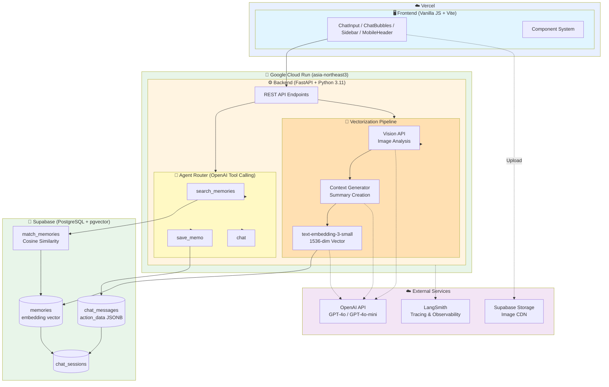

# Project Synapse - System Architecture

## Mermaid Diagram (GitHub 렌더링용)



## 상세 데이터 플로우

### 1. 이미지 업로드 및 벡터화
```
1. User Upload Image
    ↓
2. Frontend: Compress & Upload to Supabase Storage
    ↓
3. Backend: /vectorize API
    ↓
4. Vision API: Analyze image → vision_tags
    ↓
5. Context Generator: Create summary with metadata
    ↓
6. Embedding API: Generate 1536-dim vector
    ↓
7. PostgreSQL: Store in memories table with embedding
```

### 2. 자연어 검색
```
1. User Query: "제주도 사진 찾아줘"
    ↓
2. Backend: /message API
    ↓
3. Agent Router: Detect intent → search_memories
    ↓
4. Embedding API: Query → vector
    ↓
5. pgvector: Cosine similarity search
    ↓
6. Return matched memories with context
    ↓
7. GPT-4o-mini: Generate natural response
    ↓
8. Frontend: Display results + AI response
```

### 3. 대화형 메모 저장
```
1. User Message: "오늘 기분이 좋았어"
    ↓
2. Backend: /message API
    ↓
3. Agent Router: Detect intent → save_memo
    ↓
4. Embedding API: Message → vector
    ↓
5. PostgreSQL: Store in memories + chat_messages
    ↓
6. GPT-4o-mini: Generate empathetic response
    ↓
7. Frontend: Display confirmation
```

## 핵심 기술 스택

| Layer | Technology | Purpose |
|-------|-----------|---------|
| **Frontend** | Vanilla JS | SPA 구현 (커스텀 프레임워크) |
| | Vite | 번들러 |
| | exifr | EXIF 메타데이터 추출 |
| **Infra** | Vercel | 프론트엔드 배포 |
| | Google Cloud Run | 백엔드 배포 (Scale to zero) |
| **Backend** | FastAPI | 비동기 REST API |
| | OpenAI GPT-4o | Vision API (이미지 분석) |
| | OpenAI GPT-4o-mini | LLM 기반 Agent Tool Calling |
| | text-embedding-3-small | 1536-dim 벡터 생성 |
| | LangSmith | LLM 트레이싱 및 observability |
| **Database** | PostgreSQL | 관계형 데이터베이스 |
| | pgvector | 벡터 유사도 검색 |
| | Supabase | Auth + Storage + Realtime |

## 성능 최적화

| 항목 | 최적화 기법 | 성능 지표 |
|------|-----------|----------|
| Vector Search | pgvector cosine similarity + index | ~50ms |
| Message Loading | Cursor-based pagination (30/page) | 초기 로딩 최적화 |
| Image Upload | Client-side compression | 파일 크기 60% 감소 |
| API Response | FastAPI async processing | 비동기 처리 |
| Embedding Cache | (향후) Redis 캐싱 | - |
