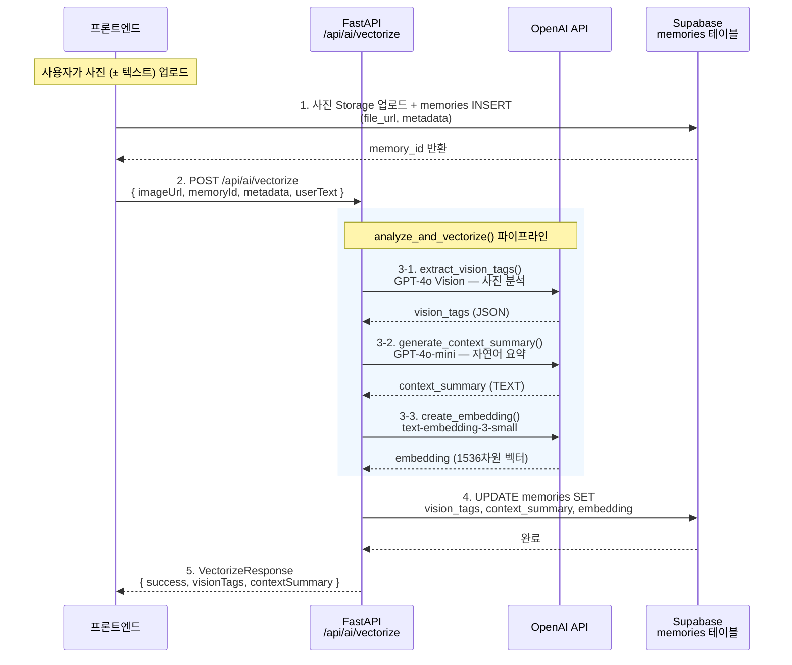
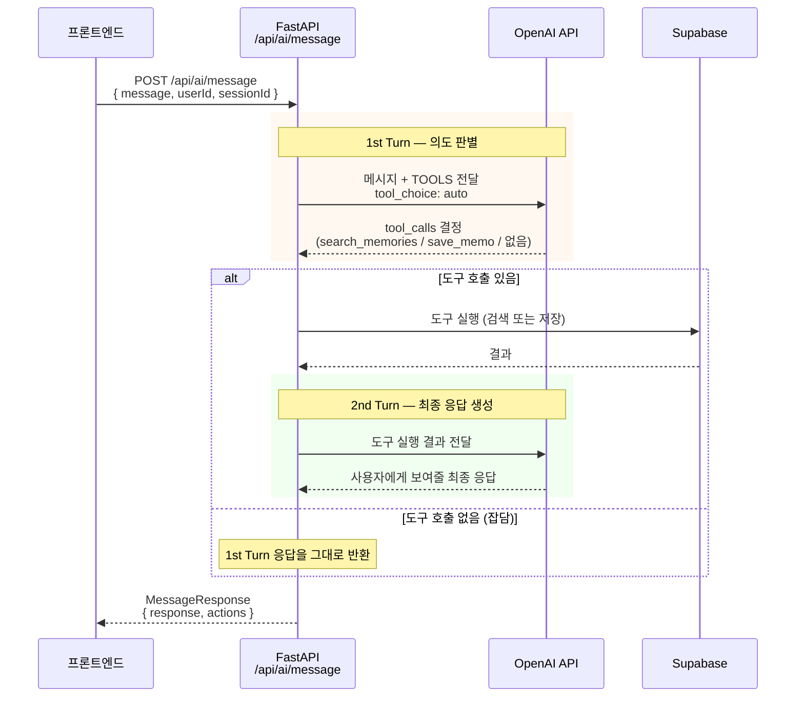

# 기능 명세서 (Functional Specification)

Synapse(가제) 백엔드의 구현된 기능과 API 명세를 정리합니다.

---

## 구현 현황

| Phase | 기능 | 상태 |
|:---|:---|:---|
| **1-A** | 벡터화 파이프라인 | ✅ 구현 완료 |
| **1-B** | MCP 채팅 라우팅 | ✅ 구현 완료 |
| **Thread** | 스레드 멀티턴 대화 | ✅ 구현 완료 |
| **2** | LangSmith 관찰성 | ⬜ 미착수 |
| **3** | LangChain 마이그레이션 | ⬜ 미착수 |

---

## Phase 1-A: 벡터화 파이프라인

### 개요
사용자가 사진(± 텍스트)을 업로드하면, Vision AI로 사진을 분석하고 자연어 요약문을 생성한 뒤 벡터로 변환하여 DB에 저장합니다. 이 데이터는 나중에 의미 기반 검색(RAG)의 원천이 됩니다.

### API 엔드포인트

#### `POST /api/ai/vectorize`

**요청 (VectorizeRequest)**
```json
{
  "imageUrl": "https://xxx.supabase.co/storage/v1/object/public/photos/IMG_1234.jpg",
  "memoryId": "a1b2c3d4-e5f6-...",
  "metadata": {
    "captureTime": { "timeOfDay": "afternoon", "season": "summer" },
    "location": { "hasLocation": true, "shortAddress": "제주도 서귀포시", "poi": "렛츠런팜" },
    "environment": { "weather": "sunny", "temp": "29°C" }
  },
  "userText": "친구랑 너무 재밌었어!"
}
```

| 필드 | 타입 | 필수 | 설명 |
|:---|:---|:---|:---|
| `imageUrl` | string | ✅ | Supabase Storage 이미지 URL |
| `memoryId` | string | ✅ | 프론트에서 memories 테이블에 INSERT 후 받은 UUID |
| `metadata` | object | ❌ | 프론트엔드가 추출한 EXIF/위치/날씨 메타데이터 |
| `userText` | string | ❌ | 사용자가 함께 입력한 텍스트 (시나리오 2) |

**응답 (VectorizeResponse)**
```json
{
  "success": true,
  "visionTags": {
    "objects": ["해바라기", "푸른 초원"],
    "peopleCount": 2,
    "dominantColors": ["Green", "Yellow"],
    "scene": "야외 자연 풍경",
    "mood": "평화로움"
  },
  "contextSummary": "2018년 여름, 제주도 렛츠런팜에서 친구 2명과 해바라기 밭을 배경으로 찍은 사진. 맑고 무더운 여름날, 행복하고 즐거운 분위기.",
  "embeddingDimensions": 1536
}
```

### 내부 처리 흐름


```
1. extract_vision_tags(imageUrl)
   → GPT-4o Vision이 사진 분석 → JSON 시각 태그 반환
   
2. generate_context_summary(metadata, visionTags, userText)
   → GPT-4o-mini가 모든 정보를 종합 → 자연어 요약문 생성

3. create_embedding(contextSummary)
   → text-embedding-3-small로 → 1536차원 벡터 변환

4. update_memory_vectorization(memoryId, visionTags, contextSummary, embedding)
   → Supabase memories 테이블 UPDATE
```

### 사용하는 AI 모델

| 모델 | 용도 | 호출 함수 |
|:---|:---|:---|
| GPT-4o | 사진 시각 분석 (Vision API) | `extract_vision_tags()` |
| GPT-4o-mini | 자연어 요약문 생성 / MCP 라우팅 / 스레드 대화 | `generate_context_summary()` / `route_message()` / `thread_conversation()` |
| text-embedding-3-small | 텍스트 → 1536차원 벡터 변환 | `create_embedding()` |

---

## Phase 1-B: MCP 채팅 라우팅

### 개요
사용자의 텍스트 입력을 OpenAI Tool Calling으로 의도를 판별하여 검색/메모 저장/일반 응답으로 자동 분기합니다.

### API 엔드포인트

#### `POST /api/ai/message`

**요청 (MessageRequest)**
```json
{
  "message": "전에 우울했을 때가 언제였지?",
  "userId": "user-uuid-...",
  "sessionId": "session-uuid-..."
}
```

| 필드 | 타입 | 필수 | 설명 |
|:---|:---|:---|:---|
| `message` | string | ✅ | 사용자 입력 텍스트 |
| `userId` | string | ✅ | Supabase Auth 사용자 UUID |
| `sessionId` | string | ✅ | chat_sessions UUID |

**응답 (MessageResponse)**
```json
{
  "response": "3월 9일에 비슷한 기록이 있었어요.",
  "actions": [
    {
      "action": "search",
      "query": "우울했던 날",
      "results": [{ "id": "...", "context_summary": "...", "similarity": 0.87 }],
      "count": 2
    }
  ]
}
```

### MCP 도구 (Tool Calling)

| 도구 | LLM이 호출하는 상황 | 파라미터 |
|:---|:---|:---|
| `search_memories` | 과거 기억을 찾거나 회상할 때 | `query`: 검색 문장 |
| `save_memo` | 감정/일기/메모를 기록할 때 | `content`: 메모 내용 |

### 내부 처리 흐름



---

## 스레드 멀티턴 대화

### 개요
검색 결과가 메인 피드에 표시된 후, 사용자가 후속 대화를 시작하면 스레드가 자동 생성됩니다. 부모 메시지(검색 결과)의 context를 유지하면서 깊은 대화를 이어갑니다.

### API 엔드포인트

#### `POST /api/ai/thread`

**요청 (ThreadRequest)**
```json
{
  "message": "첫 번째 사진 그때 무슨 일이었어?",
  "parentMessageId": "parent-msg-uuid-...",
  "sessionId": "session-uuid-..."
}
```

| 필드 | 타입 | 필수 | 설명 |
|:---|:---|:---|:---|
| `message` | string | ✅ | 스레드 내 사용자 메시지 |
| `parentMessageId` | string | ✅ | 스레드의 부모 메시지 UUID |
| `sessionId` | string | ✅ | chat_sessions UUID |

**응답 (ThreadResponse)**
```json
{
  "response": "3월 9일에 흐린 하늘 사진과 함께 '오늘 정말 힘들었어'라고 기록하셨어요."
}
```

---

## 데이터베이스 스키마 (Supabase)

### memories 테이블
사진, 사진+텍스트, 텍스트 메모를 통합 저장하는 기억 저장소.

| 컬럼 | 타입 | 설명 |
|:---|:---|:---|
| `id` | UUID (PK) | 자동 생성 |
| `user_id` | UUID (FK) | Supabase Auth 사용자 |
| `chat_session_id` | UUID (FK) | 연결된 채팅 세션 |
| `file_url` | TEXT | 이미지 URL (메모일 때 NULL) |
| `file_name` | TEXT | 원본 파일명 |
| `metadata` | JSONB | 프론트엔드 추출 메타데이터 |
| `vision_tags` | JSONB | Vision API 분석 결과 |
| `user_text` | TEXT | 사용자 입력 텍스트 |
| `context_summary` | TEXT | AI 생성 자연어 요약문 |
| `embedding` | vector(1536) | context_summary의 벡터값 |

### chat_sessions 테이블
사용자당 1개의 메인 피드 세션.

### chat_messages 테이블
채팅 말풍선 표시 전용 (벡터화 없음). `parent_message_id`로 스레드 메시지 구분.

### match_memories RPC
벡터 유사도 검색 함수 (코사인 거리 기반, 임계치 + 최대 반환 수 지정).

---

## 프로젝트 구조 (Backend)

```
backend/
├── pyproject.toml                # 의존성 관리 (uv)
├── uv.lock                       # 버전 잠금
└── app/
    ├── main.py                   # FastAPI 앱 진입점
    ├── config.py                 # 환경변수, 클라이언트 설정
    ├── routers/
    │   └── memory.py             # /vectorize, /message, /thread
    ├── schemas/
    │   └── memory.py             # Pydantic 요청/응답 모델
    └── services/
        ├── openai_service.py     # 벡터화 + MCP 라우팅 + 스레드 대화
        ├── mcp_tools.py          # Tool Calling 도구 정의 + 시스템 프롬프트
        └── supabase_service.py   # DB 연동 (저장, 검색, 스레드 조회)
```

